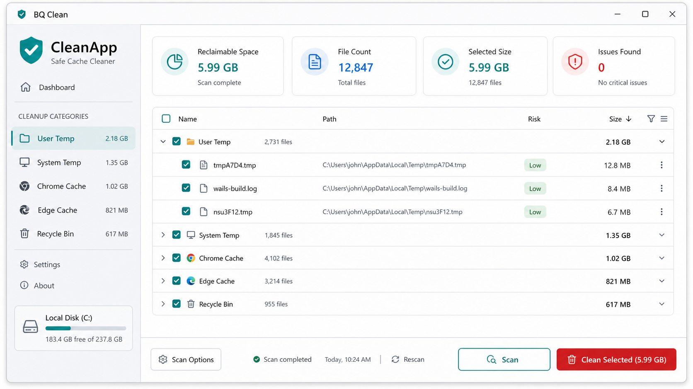

# BQ Clean

BQ Clean 是一个基于 Go 和 Wails 的 Windows 桌面缓存清理工具。它会扫描 C 盘常见缓存和临时文件位置，按类别展示可清理空间，并且只会在用户勾选和确认后删除文件。

第一版采用保守安全策略：只扫描明确允许的缓存目录，不做全盘递归清理；清理前会再次校验路径，避免误删用户文件或系统关键文件。

## 界面概念图



## 功能特性

- 基于 Wails + WebView2 的 Windows 桌面 GUI。
- 按规则扫描 C 盘常见缓存目录。
- 按类别展示文件数量和可清理空间。
- 支持文件级勾选和取消勾选。
- 清理前弹出确认窗口。
- 删除前再次校验路径是否位于允许目录内。
- 跳过 symlink、junction 和 reparse point。
- 展示跳过文件、删除失败文件和实际释放空间。
- 已添加规则、扫描、删除安全和服务流程测试。

## 当前支持的清理类别

当前内置扫描规则包括：

- 用户临时文件：`%LOCALAPPDATA%\Temp`
- 系统临时文件：`C:\Windows\Temp`
- Chrome 缓存：
  - `Cache`
  - `Code Cache`
  - `GPUCache`
  - `Service Worker\CacheStorage`
- Edge 缓存：
  - `Cache`
  - `Code Cache`
  - `GPUCache`
  - `Service Worker\CacheStorage`
- VS Code 扩展缓存：`%APPDATA%\Code\CachedExtensionVSIXs`
- Windows 系统缓存（低风险，默认勾选）：
  - `%LOCALAPPDATA%\Microsoft\Windows\Explorer`（缩略图/图标缓存）
  - `%LOCALAPPDATA%\Microsoft\Windows\INetCache`
  - `%LOCALAPPDATA%\CrashDumps`
  - `%LOCALAPPDATA%\Microsoft\Windows\WER`
- 开发者工具缓存（低风险，默认不勾选）：
  - `%LOCALAPPDATA%\npm-cache`、`pip\Cache`、`go-build`、`Yarn\Cache`、`NuGet\v3-cache`、`NuGet\Cache`
- 系统更新与日志（中风险，默认不勾选，需管理员权限）：
  - `%SystemRoot%\SoftwareDistribution\Download`、`SoftwareDistribution\DeliveryOptimization`、`Logs`、`Prefetch`
- 系统遥测日志 WMI（中风险，默认勾选，需管理员权限）：
  - `%SystemRoot%\System32\LogFiles\WMI` 下已轮转的 ETW 跟踪分段（`*.etl.*`，如 `Diagtrack-Listener.etl.001`）；正在使用的 `.etl` 活动日志、以及始终被系统锁定的 `RtBackup` 子目录会被跳过
- 第三方应用缓存（低风险，默认勾选）：
  - `%ProgramData%\Thunder Network\XLLiveUD\Download`（迅雷更新下载缓存）
- 回收站：通过 Windows API 统计和清理

以上系统/开发者缓存目录在生成扫描规则时会校验是否存在，未安装相关工具时对应目录会被自动跳过，不产生“路径不存在”报错。

浏览器的 Cookie、History、Login Data、Local Storage、Session Storage 等用户数据目录会被明确排除。

## 安全模型

BQ Clean 的核心目标是安全清理：

- 扫描器只遍历内置允许目录。
- 清理接口只接受本次扫描结果里的 `itemId`。
- 前端不能传入任意路径触发删除。
- 每次删除前都会做路径规范化和 allow-list 校验。
- 不跟随 symlink、junction 和 reparse point。
- 扫描后消失的文件会被跳过。
- 权限不足、文件占用等错误会记录并继续处理其他文件。
- 不自动提权，不主动清理高风险系统目录。

## 项目架构

```text
.
|-- app.go                         # Wails 绑定封装
|-- main.go                        # Wails 桌面入口
|-- internal/cleaner               # 清理服务编排
|   |-- model                      # Wails 暴露的共享 DTO
|   |-- rules                      # allow-list 扫描根目录和路径安全校验
|   |-- scanner                    # 只读文件扫描器
|   |-- delete                     # 安全删除引擎
|   `-- winapi                     # Windows reparse point 和回收站 API
|-- frontend
|   |-- src                        # React 界面
|   `-- wailsjs                    # Wails 生成的前端绑定
`-- AGENTG.md                      # 产品和技术方案
```

Go 后端负责扫描、分类、路径校验、删除、任务状态和 Windows API 集成。前端负责界面展示、勾选状态、确认弹窗、进度状态和结果反馈。

## 环境要求

- Windows amd64
- Go 1.24 或更新版本
- Node.js 和 npm
- Wails CLI v2
- Microsoft WebView2 Runtime

安装 Wails CLI：

```powershell
go install github.com/wailsapp/wails/v2/cmd/wails@v2.10.2
```

## 本地开发

安装前端依赖：

```powershell
cd frontend
npm install
```

运行 Go 测试：

```powershell
cd ..
go test ./...
```

开发模式启动桌面应用：

```powershell
wails dev
```

如果 `wails` 不在 `PATH`，可以直接调用 Go bin 目录里的可执行文件：

```powershell
& "$(go env GOPATH)\bin\wails.exe" dev
```

## 构建

构建生产版桌面程序：

```powershell
wails build
```

构建产物位置：

```text
build/bin/CleanApp.exe
```

只构建前端：

```powershell
cd frontend
npm run build
```

## 后端服务接口

Wails 暴露给前端的 Go 方法：

```go
func (a *App) Scan(options cleaner.ScanOptions) (cleaner.ScanResult, error)
func (a *App) Clean(request cleaner.CleanRequest) (cleaner.CleanResult, error)
func (a *App) CancelTask(taskID string) error
```

清理请求必须传入扫描结果中的 `itemId`。公开 API 不接受裸文件路径，从接口层减少误删风险。

## 测试覆盖

当前测试覆盖：

- allow-list 路径安全校验。
- Chrome 缓存规则包含和敏感数据排除。
- reparse point 子树跳过。
- 允许目录之外的删除拒绝。
- 用户临时目录的扫描和清理完整流程。

运行全部测试：

```powershell
go test ./...
```

## 当前限制

- 第一版只面向 Windows C 盘。
- 不做注册表清理。
- 不做全盘重复文件扫描。
- 不按扩展名做全盘清理。
- 不做后台常驻和定时清理。
- 不自动申请管理员权限。
- 回收站能力仅支持 Windows。

## 后续计划

- 增加后端到前端的实时进度事件。
- 扫描前支持选择清理类别。
- 补充常见 Windows 文件错误的中文提示。
- 支持导出扫描报告。
- 增加安装包和签名发布流程。
